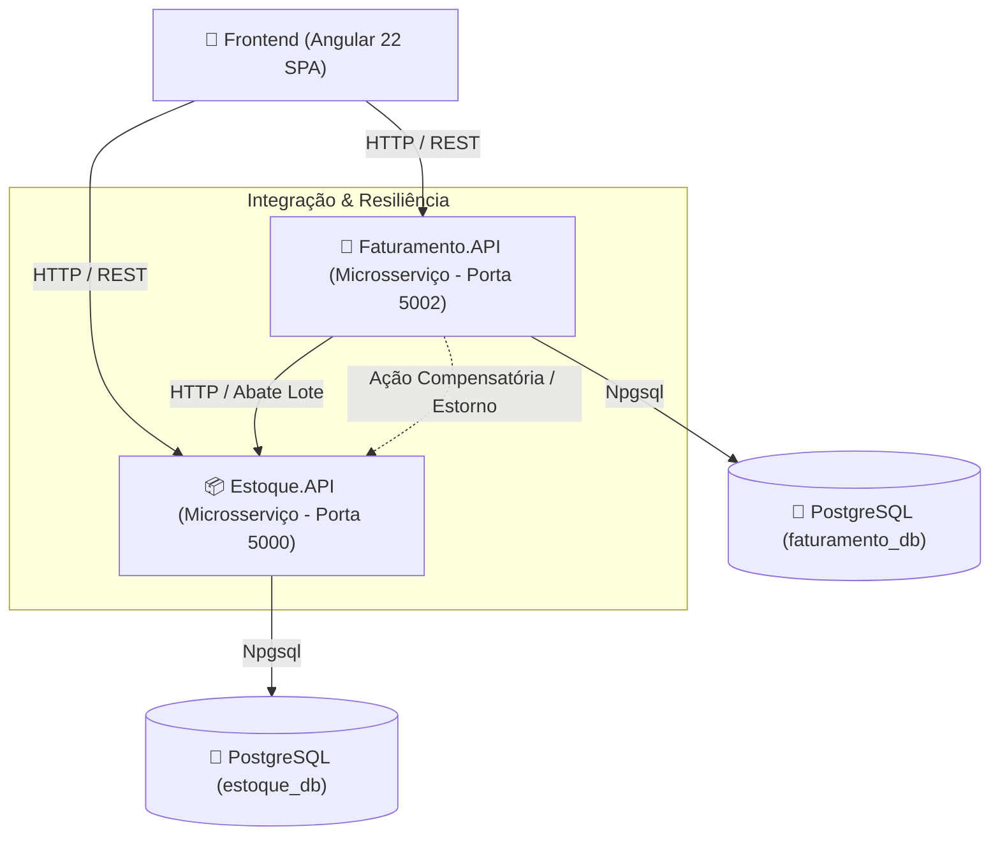

# Sistema de Gestão de Estoque e Faturamento

[](https://dotnet.microsoft.com/)
[](https://www.postgresql.org/)
[](https://angular.dev/)
[](https://xunit.net/)
[](https://www.docker.com/)

> **Projeto de Desafio Técnico / Portfólio de Engenharia de Software**  
> **Desenvolvedor:** Carlos Hygor  
> **Objetivo:** Solução distribuída em **Arquitetura de Microsserviços** desacoplada para controle de estoque e faturamento de notas fiscais, combinando **ASP.NET Core 8**, **Entity Framework Core**, **PostgreSQL**, **Angular 22** e uma suíte rigorosa de **Testes Automatizados (37 testes aprovados)**.

---

## 🏛️ Arquitetura da Solução

O sistema foi desenhado seguindo princípios de **Microsserviços**, **Clean Architecture**, **SOLID** e **Tratamento de Falhas Distribuídas**:



---

## 🛠️ Status dos Módulos & Destaques de Engenharia

### 1. 📦 Microsserviço de Estoque (`Estoque.API`) — Status: ✅ Concluído

Responsável pelo cadastro de produtos, controle de saldos, baixa em lote atômica e estornos de estoque.

#### 💡 Destaques de Engenharia:
* **DTOs Imutáveis (`C# record`)**: Transporte de dados com validações `Data Annotations` (`[Required]`, `[Range]`, `[StringLength]`).
* **Mapeamento de Alta Performance (`ProdutoMapper`)**: Extension Methods estáticos isolando a conversão DTO $\leftrightarrow$ Entidade, mantendo as Controllers limpas (Single Responsibility Principle).
* **Defesa em Profundidade (*Defense in Depth*)**:
  - Validação na aplicação C# (`Saldo >= 0`).
  - **Check Constraint física no PostgreSQL** (`CK_produtos_saldo` $\rightarrow$ `"Saldo" >= 0`) via EF Core.
* **Transação Atômica Relacional (Tudo ou Nada)**: O método `AbaterEstoqueLoteAsync` executa o abate de múltiplos produtos utilizando `BeginTransactionAsync()`. Caso qualquer item falhe ou tenha saldo insuficiente, a transação sofre `Rollback` automático.
* **Tratamento Global de Exceções (`IExceptionHandler`)**:
  - `GlobalExceptionHandler` intercepta exceções no pipeline do .NET 8.
  - Exceções de domínio dedicadas: `ProdutoNaoEncontradoException` (404), `CodigoProdutoDuplicadoException` (409) e `EstoqueInsuficienteException` (422).
* **Modularização do `Program.cs`**: Injeção de dependência e políticas de CORS isoladas em `Extension Methods` (`CorsSetup`, `DependencyInjectionSetup`).
* **Suíte de Testes Automatizados (21 Testes - 100% Passando em < 1s)**:
  - Testes Unitários de Regra de Negócio com `xUnit`, `Moq` e `FluentAssertions`.
  - Testes de Transação Atômica Real utilizando `SQLite In-Memory` com suporte a `Rollback`.
  - Testes E2E HTTP via `WebApplicationFactory<Program>`.

---

### 2. 📜 Microsserviço de Faturamento (`Faturamento.API`) — Status: ✅ Concluído

Responsável pela criação de Notas Fiscais com numeração sequencial automática e orquestração de impressão com abate de estoque.

#### 💡 Destaques de Engenharia:
* **Integração Distribuída (`EstoqueClient`)**: Comunicação via `HttpClientFactory` resiliente chamando a API de Estoque para baixa de lote atômica.
* **Resiliência & Padrão Saga (Ação Compensatória)**:
  - Ao imprimir uma Nota Fiscal (`Status` Aberta $\rightarrow$ Fechada), a API solicita o abate de lote ao `Estoque.API`.
  - Se a baixa no estoque for confirmada, mas a gravação final do status na base do Faturamento falhar (ex: erro de banco), a API aciona automaticamente a **Ação Compensatória** (`EstornarEstoqueLoteAsync`) no `Estoque.API` para devolver o saldo dos produtos e manter a consistência entre os microsserviços.
* **Máquina de Estados & Regras de Negócio**:
  - Notas Fiscais iniciam com status `Aberta`.
  - Impedimento de exclusão ou alteração de notas com status `Fechada`.
  - Numeração sequencial gerada automaticamente por transação.
* **Tratamento Global de Exceções (`IExceptionHandler`)**:
  - Exceções de domínio dedicadas: `NotaFiscalNaoEncontradaException` (404), `NotaFiscalStatusInvalidoException` (400) e `ServicoEstoqueIndisponivelException` (503).
* **Suíte de Testes Automatizados (16 Testes - 100% Passando em < 1s)**:
  - Testes Unitários cobrindo o fluxo de criação, impressão, Ação Compensatória e validações de estado.
  - Testes E2E HTTP com simulação de integração via `Mock<IEstoqueClient>` e `WebApplicationFactory<Program>`.

---

### 3. 💻 Frontend Web (`frontend`) — Status: ⏳ Em Desenvolvimento

Interface SPA em **Angular 22** para interação do usuário com os microsserviços.

#### ⚙️ Recursos Mapeados:
* Arquitetura de **Standalone Components** e **Angular Signals** para reatividade simples e performática.
* Telas de cadastro e listagem paginada de produtos.
* Emissão de Notas Fiscais com múltiplos itens.
* Botão intuitivo de impressão com indicador de processamento (*loading*) e tratamento de mensagens de erro amigáveis vindas das APIs.

---

## 🔐 Gestão de Secrets & Configurações de Ambiente

A aplicação segue a **Cadeia Hierárquica de Configurações do .NET 8**:

1. **Zero-Friction Onboarding (Avaliação Técnica Local)**:
   - Os arquivos `appsettings.json` contêm valores padrões pré-configurados para que avaliadores e recrutadores possam rodar a aplicação imediatamente (`dotnet run` / `docker-compose`) sem necessidade de criar arquivos `.env` ou configurar variáveis manualmente.
2. **Ambiente de Produção / CI/CD**:
   - Em produção, credenciais de banco de dados e URLs de microsserviços são injetadas via **Variáveis de Ambiente** utilizando o separador `__` (duplo underline):
     - `ConnectionStrings__EstoqueConnection="Server=prod-db;..."`
     - `ConnectionStrings__FaturamentoConnection="Server=prod-db;..."`
     - `Services__EstoqueUrl="http://estoque-api-prod:5000"`
3. **Desenvolvimento Seguro Local (`.NET User Secrets`)**:
   - Para evitar commitar credenciais locais no Git:
     ```bash
     dotnet user-secrets set "ConnectionStrings:EstoqueConnection" "Host=...;Database=...;Username=...;Password=..."
     ```

---

## 🧪 Como Executar a Suíte Completa de Testes (37 Testes)

Para executar a suíte de testes de ambos os microsserviços:

```bash
dotnet test backend/Estoque.API.Tests/Estoque.API.Tests.csproj && dotnet test backend/Faturamento.API.Tests/Faturamento.API.Tests.csproj
```

**Resultado esperado:**
```text
Passed!  - Failed: 0, Passed: 21, Skipped: 0, Total: 21 (Estoque.API.Tests.dll)
Passed!  - Failed: 0, Passed: 16, Skipped: 0, Total: 16 (Faturamento.API.Tests.dll)
Total: 37 testes aprovados!
```

---

## 🚀 Como Rodar os Microsserviços Localmente

### 1. Requisitos
- .NET 8 SDK
- Docker & Dev Container (ou PostgreSQL 16 rodando localmente)

### 2. Executar o Microsserviço de Estoque (`Estoque.API`)
```bash
dotnet run --project backend/Estoque.API/Estoque.API.csproj
```
- **Swagger UI**: `http://localhost:5000/swagger`
- **Health Check**: `http://localhost:5000/health`

### 3. Executar o Microsserviço de Faturamento (`Faturamento.API`)
Em outro terminal:
```bash
dotnet run --project backend/Faturamento.API/Faturamento.API.csproj
```
- **Swagger UI**: `http://localhost:5002/swagger`
- **Health Check**: `http://localhost:5002/health`

---

## 📬 Tabela Completa de Endpoints HTTP

### 📦 Estoque API (`Estoque.API` - Porta 5000)

| Método | Endpoint | Descrição | Status HTTP |
| :--- | :--- | :--- | :--- |
| **`GET`** | `/health` | Health Check nativo de disponibilidade | `200 OK` |
| **`GET`** | `/api/produtos` | Lista paginada de produtos | `200 OK` |
| **`GET`** | `/api/produtos/{id}` | Detalhes do produto por ID | `200 OK`, `404 NotFound` |
| **`GET`** | `/api/produtos/codigo/{codigo}` | Detalhes do produto por Código | `200 OK`, `404 NotFound` |
| **`POST`** | `/api/produtos` | Cadastra um novo produto | `201 Created`, `400 BadRequest`, `409 Conflict` |
| **`PUT`** | `/api/produtos/{id}` | Atualiza dados de um produto | `204 NoContent`, `404 NotFound`, `409 Conflict` |
| **`DELETE`** | `/api/produtos/{id}` | Remove um produto do estoque | `204 NoContent`, `404 NotFound` |
| **`POST`** | `/api/produtos/{codigo}/abater` | Abate quantidade individual | `200 OK`, `422 UnprocessableEntity`, `404 NotFound` |
| **`POST`** | `/api/produtos/abater-lote` | Abate atômico de múltiplos produtos em lote | `200 OK`, `422 UnprocessableEntity`, `404 NotFound` |
| **`POST`** | `/api/produtos/estornar-lote` | Reverte/Estorna lote de produtos (Ação Compensatória) | `200 OK`, `400 BadRequest` |

### 📜 Faturamento API (`Faturamento.API` - Porta 5002)

| Método | Endpoint | Descrição | Status HTTP |
| :--- | :--- | :--- | :--- |
| **`GET`** | `/health` | Health Check nativo de disponibilidade | `200 OK` |
| **`GET`** | `/api/notasfiscais` | Lista paginada de Notas Fiscais | `200 OK` |
| **`GET`** | `/api/notasfiscais/{id}` | Detalhes da Nota Fiscal por ID | `200 OK`, `404 NotFound` |
| **`GET`** | `/api/notasfiscais/numeracao/{num}` | Busca Nota Fiscal por numeração sequencial | `200 OK`, `404 NotFound` |
| **`POST`** | `/api/notasfiscais` | Cria Nota Fiscal com status inicial `Aberta` | `201 Created`, `400 BadRequest` |
| **`POST`** | `/api/notasfiscais/{id}/imprimir` | Imprime Nota, abate estoque e altera status para `Fechada` | `200 OK`, `400 BadRequest`, `404 NotFound`, `503 ServiceUnavailable` |
| **`DELETE`** | `/api/notasfiscais/{id}` | Remove Nota Fiscal (apenas no status `Aberta`) | `204 NoContent`, `400 BadRequest`, `404 NotFound` |

---

## ✒️ Licença e Autoria
Desenvolvido por **Carlos Hygor** como solução do desafio técnico e portfólio prático de engenharia de software em ecossistema .NET e Angular.