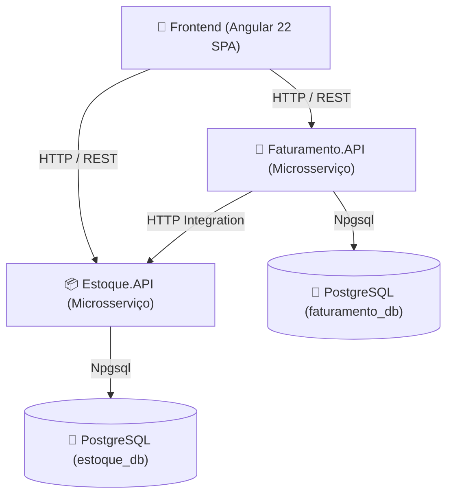

# Sistema de Gestão de Estoque e Faturamento

[](https://dotnet.microsoft.com/)
[](https://www.postgresql.org/)
[](https://angular.dev/)
[](https://xunit.net/)
[](https://www.docker.com/)

> **Projeto de Desafio Técnico / Portfólio de Engenharia de Software**  
> **Desenvolvedor:** Carlos Hygor  
> **Objetivo:** Construção de uma solução distribuída em **Arquitetura de Microsserviços** desacoplada para controle de estoque e faturamento de notas fiscais, combinando **ASP.NET Core 8**, **Entity Framework Core**, **PostgreSQL**, **Angular 22** e uma suíte completa de **Testes Automatizados**.

---

## 🏛️ Arquitetura da Solução

O sistema foi desenhado seguindo os princípios de **Microsserviços**, **SOLID**, **Clean Code** e **Defesa em Profundidade**, separado nas seguintes camadas:



---

## 🛠️ Status dos Módulos & Funcionalidades

### 1. 📦 Microsserviço de Estoque (`Estoque.API`) — Status: ✅ Concluído

Responsável pelo cadastro de produtos, controle de saldos e operações de abate de estoque solicitadas pelo Faturamento.

#### 💡 Destaques de Engenharia & Boas Práticas:
* **DTOs Imutáveis (`C# record`)**: Utilização de `records` com validações `Data Annotations` (`[Required]`, `[Range]`, `[StringLength]`) para garantir transporte de dados seguro.
* **Mapeamento de Alta Performance (`ProdutoMapper`)**: Extension Methods estáticos isolando a conversão DTO $\leftrightarrow$ Entidade, mantendo a Controller 100% limpa (Single Responsibility Principle).
* **Defesa em Profundidade (*Defense in Depth*)**:
  - Validações na camada de aplicação C# (`Saldo >= 0`).
  - **Check Constraint física no PostgreSQL** (`CK_produtos_saldo` $\rightarrow$ `"Saldo" >= 0`) via EF Core.
* **Otimização de Performance no Banco**: Tratamento direto de `DbUpdateException` para capturar a restrição de índice único de `Codigo`, economizando chamadas desnecessárias de `SELECT` prévio.
* **Suíte de Testes Automatizados (13 Testes - 100% Passando em < 1s)**:
  - **Testes Unitários de Regra de Negócio** (`xUnit` + `Moq` + `FluentAssertions`): Validação de caminhos felizes e exceções customizadas (`EstoqueInsuficienteException`, `CodigoProdutoDuplicadoException`).
  - **Testes de Integração de Repositório**: Persistência e consultas reais via `EF Core InMemory`.
  - **Testes E2E de Web API HTTP**: Validação completa da pipeline HTTP (Status `200`, `400`, `422`) usando a ferramenta oficial `WebApplicationFactory<Program>`.
* **Automação de CI/CD Integrada**:
  - **Git Hook Pre-Commit (`.git/hooks/pre-commit`)**: Trava local que executa `dotnet test` automaticamente em < 500ms e bloqueia o commit caso haja código quebrado.
  - **GitHub Actions Workflow (`.github/workflows/ci.yml`)**: Pipeline de CI na nuvem para Build e Testes em Pushes e PRs.
* **Massa de Dados Inicial (Seed Data)**: Carga automática de 35 produtos fictícios realistas via `data.sql` e `DbInitializer`.

---

### 2. 📜 Microsserviço de Faturamento (`Faturamento.API`) — Status: ⏳ Em Desenvolvimento

Responsável pela emissão, controle de numeração sequencial e fechamento de Notas Fiscais.

#### ⚙️ Funcionalidades Mapeadas:
* Modelagem de Entidades `NotaFiscal` e `ItemNotaFiscal` com relacionamento 1:N.
* Mapeamento do Enum `StatusNotaFiscal` (`Aberta`, `Fechada`) como `string` no banco para legibilidade e imunidade a refatorações de ordinal.
* Orquestração de abate de saldo chamando o endpoint de integração do `Estoque.API`.
* Tratamento de resiliência e falhas de comunicação entre serviços.

---

### 3. 💻 Frontend Web (`frontend`) — Status: ⏳ Em Desenvolvimento

Interface SPA desenvolvida em **Angular 22** para interação do usuário com os microsserviços.

#### ⚙️ Recursos Mapeados:
* Arquitetura de **Standalone Components** e **Angular Signals** para reatividade simples e performática.
* Injeção de dependência via `provideHttpClient()`.
* Telas de cadastro de produtos, emissão de notas fiscais e indicador de processamento durante a impressão.

---

## 🧪 Como Executar a Suíte de Testes

Para executar os 13 testes automatizados (Unitários, Integração e E2E):

```bash
dotnet test backend/Estoque.API.Tests/Estoque.API.Tests.csproj
```

**Resultado esperado:**
```text
Passed!  - Failed: 0, Passed: 13, Skipped: 0, Total: 13, Duration: 786 ms
```

---

## 🚀 Como Rodar o Microsserviço de Estoque (`Estoque.API`)

### 1. Requisitos
- .NET 8 SDK
- Docker & Dev Container (ou PostgreSQL 16 rodando localmente)

### 2. Executar a API
No terminal Linux / Dev Container:

```bash
dotnet run --project backend/Estoque.API/Estoque.API.csproj
```

### 3. Acessar a Documentação Interativa (Swagger)
Abra no seu navegador:
- **Swagger UI**: `http://localhost:5000/swagger` ou `http://localhost:5001/swagger`
- **Ping de Disponibilidade**: `http://localhost:5000/api/estoque/ping`

---

## 📬 Endpoints da API de Estoque (`Estoque.API`)

| Método | Endpoint | Descrição | Status HTTP |
| :--- | :--- | :--- | :--- |
| **`GET`** | `/api/produtos` | Lista todos os produtos cadastrados | `200 OK` |
| **`GET`** | `/api/produtos/{id}` | Busca um produto pelo ID único | `200 OK`, `404 NotFound` |
| **`GET`** | `/api/produtos/codigo/{codigo}` | Busca um produto pelo Código | `200 OK`, `404 NotFound` |
| **`POST`** | `/api/produtos` | Cadastra um novo produto | `201 Created`, `400 BadRequest`, `409 Conflict` |
| **`PUT`** | `/api/produtos/{id}` | Atualiza dados de um produto | `204 NoContent`, `404 NotFound`, `409 Conflict` |
| **`DELETE`** | `/api/produtos/{id}` | Remove um produto do estoque | `204 NoContent`, `404 NotFound` |
| **`POST`** | `/api/produtos/{codigo}/abater` | Abate a quantidade em estoque (Faturamento) | `200 OK`, `422 UnprocessableEntity`, `404 NotFound` |

---

## ✒️ Licença e Autoria
Desenvolvido por **Carlos Hygor** como solução do desafio técnico e portfólio prático de engenharia de software em ecossistema .NET e Angular.